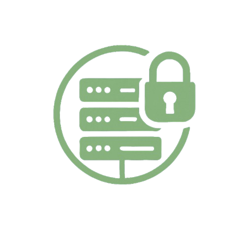

# Atlas Panel

<div align="center">
  
  <h3>Server Management System</h3>
  <p>A modern, secure server monitoring and management platform</p>
</div>

## Features

- **Real-time Server Monitoring** - Track CPU, RAM, disk usage, and uptime
- **Secure Remote Shell Access** - Execute commands on remote servers
- **User Management** - Role-based access control (Admin, System, User)
- **Modern Web Interface** - Clean, responsive design
- **Cross-platform Support** - Works on Windows, macOS, and Linux

## Installation

### Prerequisites
- Go 1.21+
- Node.js 18+ and npm

### Quick Start

1. **Clone and build**
   ```bash
   git clone https://github.com/your-org/atlas-panel.git
   cd atlas-panel
   
   # Build API server
   cd api && go build -o atlas-api
   
   # Build node agent
   cd ../node && go build -o atlas-node
   
   # Build web panel
   cd ../panel && npm install && npm run build
   ```

2. **Configure**
   
   Create `api/config.json`:
   ```json
   {
     "port": 8080,
     "database": "atlas.db",
     "jwt_secret": "your-secret-key-here"
   }
   ```
   
   Create `node/config.json`:
   ```json
   {
     "port": 3040,
     "api_key": "your-api-key-here",
     "server_url": "http://localhost:8080"
   }
   ```

3. **Run**
   ```bash
   # Start API server
   cd api && ./atlas-api
   
   # Start node agent (on target servers)
   cd node && ./atlas-node
   ```

## Architecture

- **API Server** (`/api`) - Go backend with SQLite database
- **Node Agent** (`/node`) - Go agent for system monitoring
- **Web Panel** (`/panel`) - TypeScript frontend with Vite

## Development

```bash
# API Server
cd api && go run main.go

# Node Agent
cd node && go run main.go

# Web Panel
cd panel && npm run dev
```

## License

MIT License - see [LICENSE](LICENSE) file for details.

## Links

- **Website**: [getatlas.dev](https://getatlas.dev)
- **Version**: 0.0.1